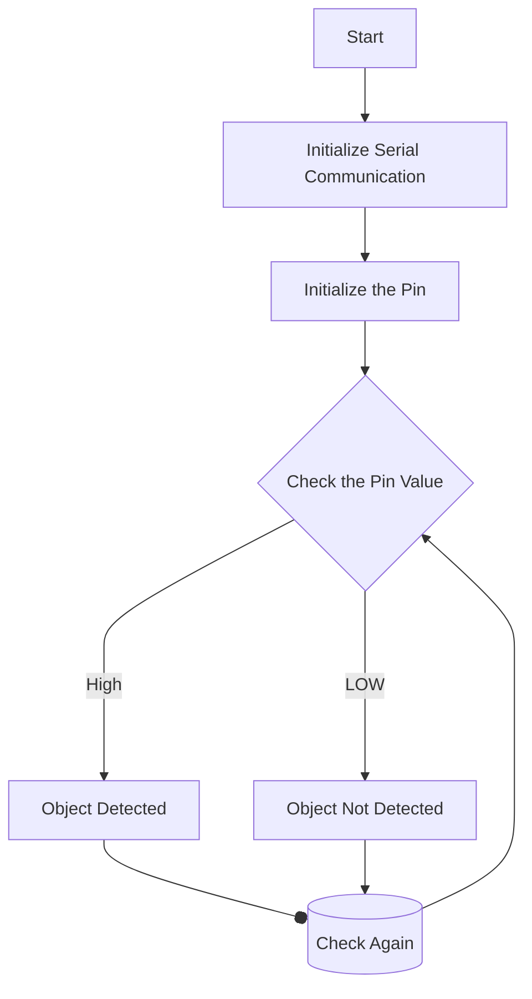

# Embedded-Systems-Workshop

Embedded Systems Workshop by Dr.Sajesh Kumar U

## How to create a new github project

1. Go to [Github.com](www.gihub.com)
   
2. Click on `Sign in`


3. Click on Create a new and create a new one

 4. After Creating account Click on `New`
If this option is not in the window for some reason then click on the profile icon and select `Your Repocitories`


5. Give This new project any title like for example `Embedded-Systems-Workshop`


6. Now you are ready to upload some code


## Programs

### Day 1

1. Led Blink

```c
void setup(){
pinMode(D2,OUTPUT)
}
void loop(){
  digitalWrite(D2,HIGH);
  delay(1000);
  digitalWrite(D2,LOW);
  delay(1000);
}
```

2. Led Blink With Switch

```c
bool status=0;
void setup(){
  pinMode(D2,OUTPUT);
  pinMode(D4,INPUT);
}
void loop(){
  status = digitalRead(D4);
  if (status == HIGH){
    digitalWrite(D2,HIGH);
  }
  else{
    digitalWrite(D2,LOW);
  }
  delay(1000);
}
```

3. Toggle LED

```c
bool status=0;
void setup(){
  pinMode(D2,OUTPUT);
  pinMode(D4,INPUT);
}
void loop(){
  if (digitalRead(D4) == HIGH){
    digitalWrite(D2,(status ^= 1));
  }
  delay(50);
}
```

Explanation :

```c
 if (digitalRead(D4) == HIGH){
    digitalWrite(D2,(status ^= 1));
  }
```

- First checks if the input is \*_HIGH(3.3V Logic 1)_ or not
- If `HIGH` the conditional statement's body will get executed

```c
digitalWrite(D2,(status ^= 1));
```

This line writes `HIGH` if the value of `staus` is `LOW` then toggles the
`status` using `status ^= 1` which performs the following operation

$$
\text{status} \oplus 1
$$

`xor` ing a number with `1` will invert its value just like `not` operation 4. adding Debugging Capabilities to LED Contorl

```c
bool status=0;
void setup(){
  Serial.begin(115200);
  pinMode(D2,OUTPUT);
  pinMode(D4,INPUT);
}
void loop(){
  status = digitalRead(D4);
  if (status == HIGH){
    digitalWrite(D2,HIGH);
    Serial.println("LED HIGH");
  }
  else{
    digitalWrite(D2,LOW);
    Serial.println("LED LOW");
  }
  delay(1000);
}
```

### Day 2

<!-- Source : Embedded Systems Workshop by Sajesh Kumar U -->

1. IR Sensor Interfacing
   Objective: Object detection using `IR` Sensor

```c
void setup() {
  Serial.begin(115200); // Init Serial at 115200 Baud Rate.
  Serial.println("Serial Working"); // Test to check if serial is working or not
  pinMode(5, INPUT); // IR Sensor pin INPUT
}
void loop(){
  int sensorStatus = digitalRead(5); // Set the GPIO as Input
  if (sensorStatus == 0) // Check if the pin high or not
  {
    // if the pin is high turn off the onboard Led
    Serial.println("Object Detected!"); // print Motion Detected! on the serial monitor window
  }
  else  {
    //else turn on the onboard LED
    Serial.println("Free to move"); // print Motion Ended! on the serial monitor window
  }
}
```



2. ESP32_LED_analog_brightness

```c
void setup() {
}

void loop() {
for(int dcy=0; dcy<255; dcy++)
{
  analogWrite(5, dcy);
  analogWrite(18, dcy);
  analogWrite(19, dcy);
  delay(5);
}
for(int dcy=255; dcy>0; dcy--)
{
  analogWrite(5, dcy);
  analogWrite(18, dcy);
  analogWrite(19, dcy);
  delay(5);
}
}
```
