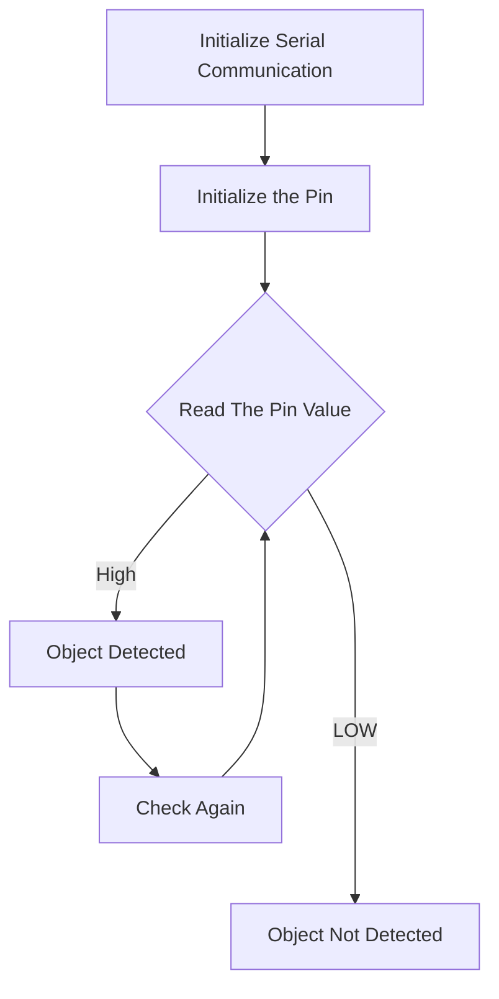

# Embedded-Systems-Workshop

Embedded Systems Workshop by Dr.Sajesh Kumar U

## Programs

<!-- Source : Embedded Systems Workshop by Sajesh Kumar U -->

1. IR Sensor Interfacing
   Objective: Object detection using `IR` Sensor

```c
void setup() {
  Serial.begin(115200); // Init Serial at 115200 Baud Rate.
  Serial.println("Serial Working"); // Test to check if serial is working or not
  pinMode(5, INPUT); // IR Sensor pin INPUT
}
void loop(){
  int sensorStatus = digitalRead(5); // Set the GPIO as Input
  if (sensorStatus == 0) // Check if the pin high or not
  {
    // if the pin is high turn off the onboard Led
    Serial.println("Object Detected!"); // print Motion Detected! on the serial monitor window
  }
  else  {
    //else turn on the onboard LED
    Serial.println("Free to move"); // print Motion Ended! on the serial monitor window
  }
}
```


